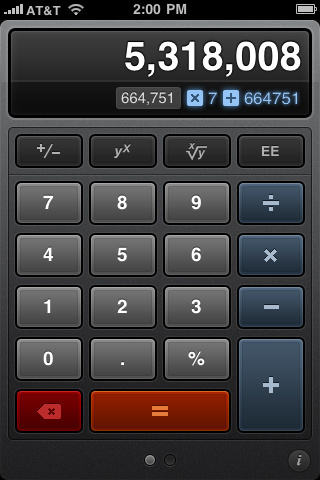

# Clonebot (a Calcbot clone)

Development work on Clonebot for [A Permanent Wreck]("http://wrck.me/").

So for some strange reason, I was inspired to build a calculator using *HTML*, *CSS* &amp; *Javascript*. For my "design" inspiration, I basically ripped off the best looking calculator I know of&hellip;[Calcbot](http://tapbots.com/software/calcbot/). The project uses only 1 image, a noise background for flare, that I was able to infer from the screenshot I found, the rest was all HTML and CSS using as semantical sense as I could given the project.  I realize that there is no value in this project for anyone out there, but when I was trying to figure it out, there wasn't anything I could find to help get me started or working through some issues I ran into.  I figured I would document it on Github.  Its very basic right now, and there is no error checking just yet, but I will constantly improving it include things like error checking, keyboard support, more advanced calculations, possibly scientific calculations, iPhone web support, media queries, orientation changes, layout adaptations, and anything else I can figure out.  It was definitely a fun experience as it forced me to think about things in a different way.

 *The sexiest calculator since the Ti81!*

## Technologies Used
**User Interface**: HTML (5), CSS (3), Javascript ( [jQuery]("http://jquery.com/") ) 
**Version Control**: [Git]("http://git-scm.com") 

Below is my synopsis of the project and how I worked on it in order of technology. I never realized how I approached different projects and problems, so it was fun to see realize I started with the Javascript first on this project, after building a basic page.

### HTML
So I started building a simple HTML page with a `
` for displaying the result and an unordered list (`<ul>`) with all of the numbers and operations contained within.  Seems pretty simple. Using `<input />` buttons as my way to pull in values seemed to make the most semantic sense; a user will be inputting data through a button, so it made sense.  After the page was completed, on to the javascript. It actually turned out I had to update the HTML in order to pair up with my design choice.  Not too much work had to go into adapting it.  I tried to think of a way to incorporate some HTML 5 tags, but there wasn't a whole lot of options, I could think of&hellip;I'm sure someone will say something about that.

### Javascript
As I only gave myself a time limit of what I could accomplish in a day, outside of my 9-hour workday, it is really basic in functionality; my work day roughly translates into two hours before work, and approximately four hours before my wife gets home and/or bedtime. I created an object with a few properties to grab the elements, such as the buttons and results window, and two methods; 1 for grabbing the elements clicked and processing the input, the other for printing out on the screen.  Given more time, I would have added a lot more separation of the methods and included more functionality with the calculator.

As of now, you have to input the numbers in the correct order (first term, operand, second term, press the equals (=) button) for it to work properly.  There is no error checking as of now, but it will come in a future update, along with the aforementioned functionality.

### CSS
The CSS was probably the most complex.  It's main support is the modern browsers, including Internet Explorer 9, but I haven't been able to check the others.  As I strive for graceful degredation, I'm sure I still have some more work in order to support the older ones.  As far as the CSS, there are a lot of gradients, on not only the buttons, the hover state of the buttons, but the body of the calculator, and even a radial gradient on the body to give that blue glowing flare.  One thing to note about the keypadis, check out the HTML.  The buttons go in a very specific semantic order, numbers 1-9,0, then the operations in order of priority (PEMDAS), then the equals, and then the clear.  But if you look at the presentation, they are as they would appear on the calculator.  I created a grid using absolute positioning to accomplish this.  `.Row1` - `.Row5` and `.Col1` - `.Col4` were added accordingly to where they needed to appear.

Other than that, there is some `text-shadow`, `box-shadow`, `border-radius` used, and some unique character entities to accomplish the actual division and multiplication signs. I also added a transform on the button when active, so you get that real-to-life press down feeling. Hope you enjoy and please leave issues or feedback if you feel inclined. 

## License
 
Attribution-NonCommercial-NoDerivs CC BY-NC-ND

## Credits
**Design**: [Mark Jardine](http://twitter.com/markjardine) of [Tapbots](http://tapbots.com/) 
**User Interface**: [Me](http://twitter.com/apermanentwreck) 

